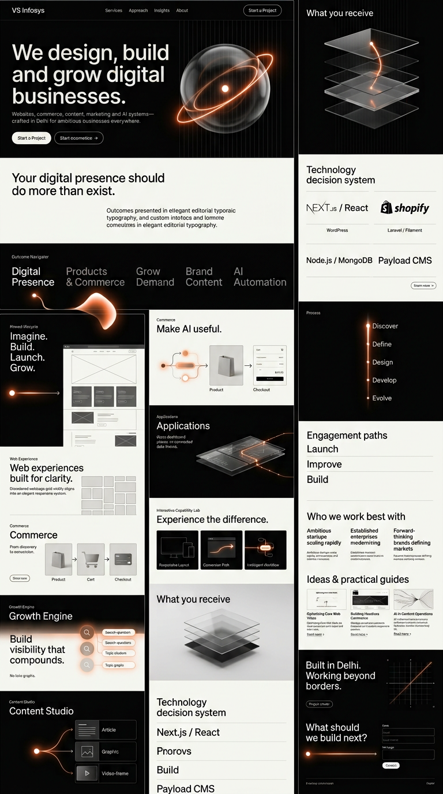
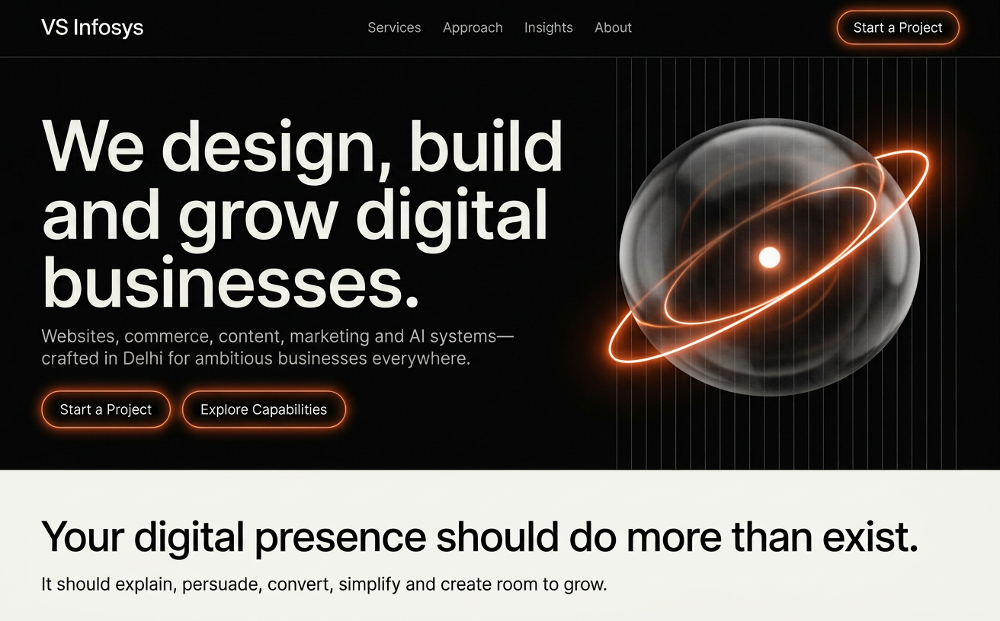
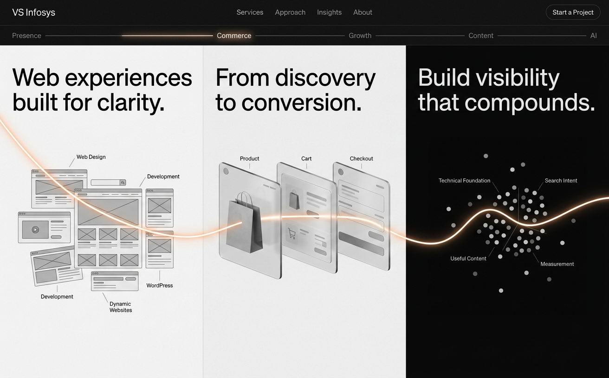
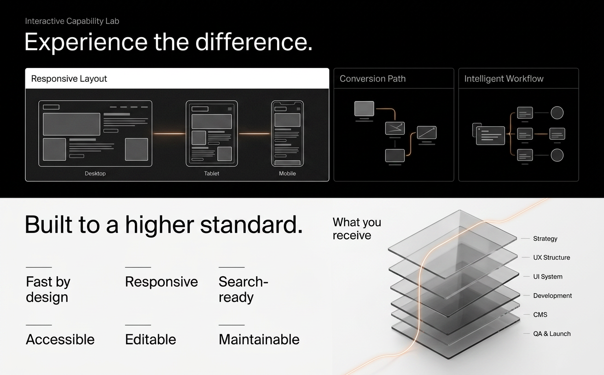
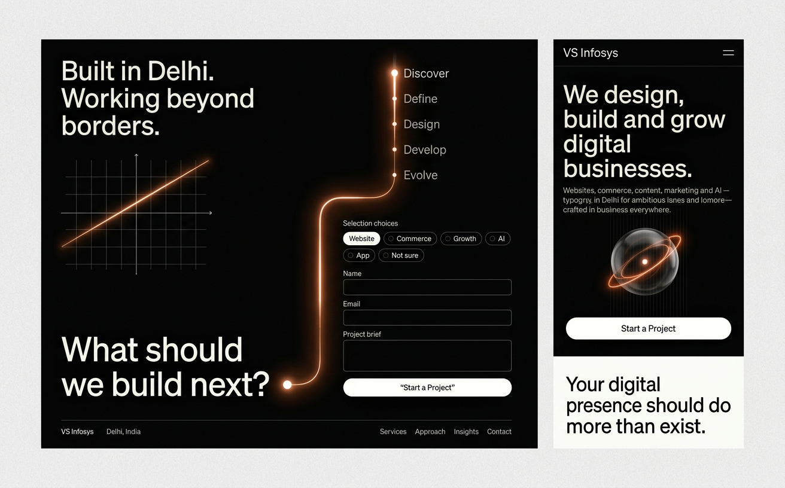

# VS Infosys — Final Homepage Visual Concept

This concept follows the research-backed [Design Bible](../../DESIGN_BIBLE.md). The website itself acts as the primary demonstration of VS Infosys’s design and technology capability. It contains no portfolio, fictional clients, testimonials, awards or fabricated results.

## 1. Full Homepage Overview

The overview compresses the complete 20-section homepage into a visual map. The detailed frames below are the higher-fidelity references for typography, content and spacing.

## 2. Hero and Opening Chapter

**Key direction:**

- Immediate service positioning
- Black cinematic canvas
- Translucent monochrome hero object
- Orange-white light as the recurring narrative device
- Calm white chapter after the dramatic opening

## 3. Connected Services Story

**Key direction:**

- Services presented as one connected business journey
- Web experience, commerce and growth shown through demonstrations
- Persistent chapter-progress indicator
- No portfolio or fictional projects
- The glowing line moves through every capability

## 4. Capability and Credibility

**Key direction:**

- Interactive Capability Lab replaces the portfolio section
- Responsive layout, conversion and workflow demonstrations
- Credibility built through tangible standards and deliverables
- Layered glass system illustrates what a client receives

## 5. Process, Contact and Mobile

**Key direction:**

- Delhi positioning without landmark clichés
- Illuminated process timeline flows into the enquiry form
- Strong final conversion chapter
- Mobile retains the visual identity with simpler motion and normal vertical reading

## Planned Motion in the Coded Experience

These images are static keyframes. The production experience is planned to include:

- Hero object reveal and orbital light movement
- Light trace connecting homepage chapters
- Pinned “Imagine → Build → Launch → Grow” sequence
- Interface blocks assembling into a responsive grid
- Product journey moving through Product → Cart → Checkout
- Search nodes organizing into topic clusters
- Content branching into article, graphic and video formats
- AI workflow connections illuminating in sequence
- Capability Lab demonstrations responding to selection
- Glass deliverable layers assembling into one system
- Discover → Define → Design → Develop → Evolve timeline
- Reduced-motion and lightweight mobile alternatives

## Review Note

The prominent copy and section direction in the detailed frames are the intended references. Very small text inside AI-generated imagery is only visual filler and will be written precisely during the content and UI design phase.
